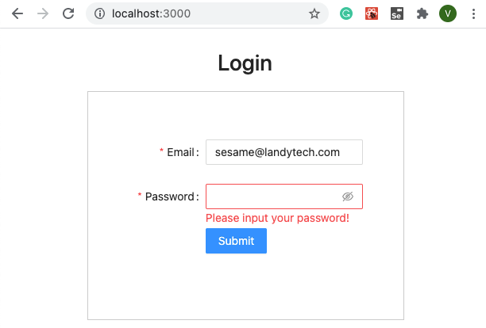
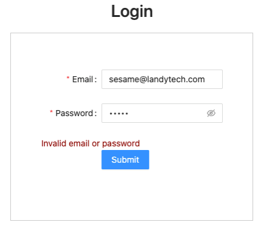
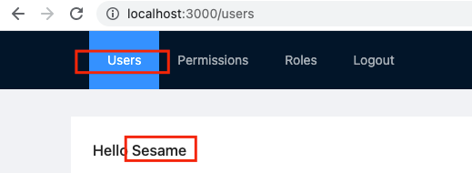
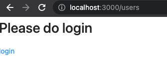
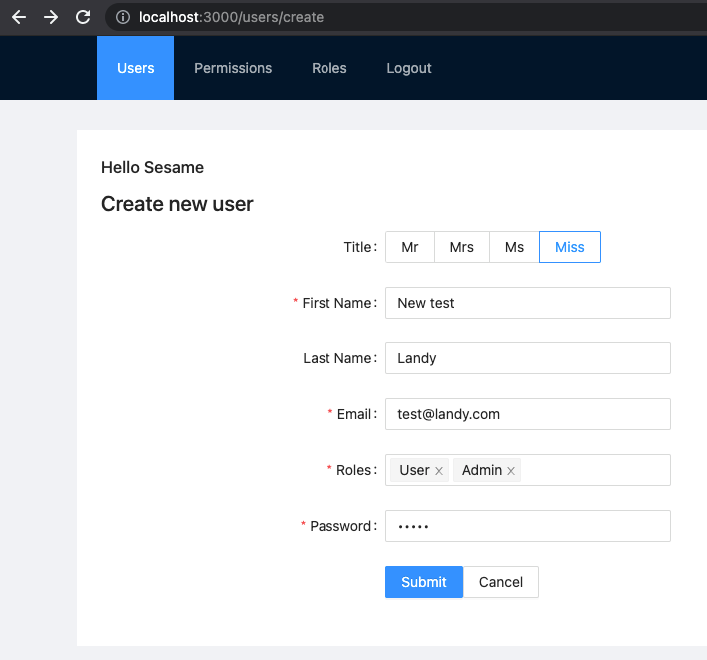
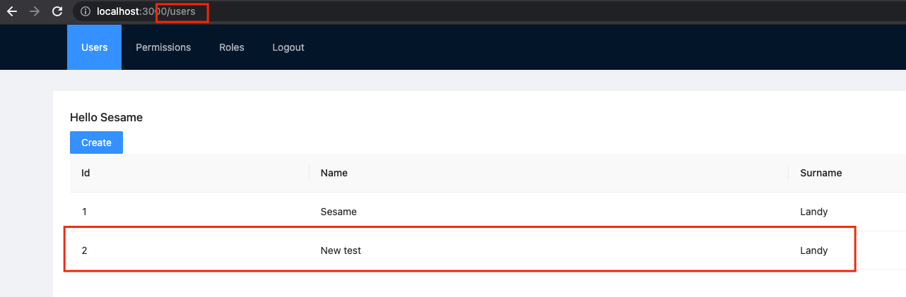
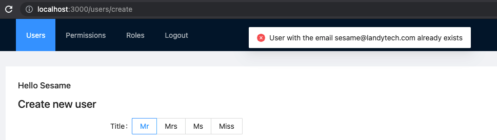
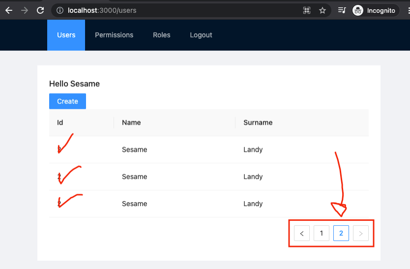

Welcome to the Landy Cypress Test. This readme will guide you around the different challenges.

# Getting Started

First, run the development server:

```bash
yarn install
yarn dev
```

Open [http://localhost:3000](http://localhost:3000) with your browser to see the result.

# Install cypress

We expect that you have enough knowledge to install and set up Cypress.js. 

Is recommended to read the following:
- Video [Cypress in a nutshell](https://docs.cypress.io/guides/overview/why-cypress).
- Tutorial [Super-patterns](https://dev.to/wescopeland/cypress-super-patterns-how-to-elevate-the-quality-of-your-test-suite-1lcf)
- Video [Cypress Patterns and Practices](https://www.youtube.com/watch?v=V-o8WzlwKmM)

# Challenge 1 - Login

Create 4 scenarios that cover:

## Scenario 1 - check required fields
Visit `http://localhost:3000`.

Try login without informing password. 

Assert that:
- the system don't submit the request, and,
- display the information that `Please input your password!`



## Scenario 2 - check invalid password

- Visit `http://localhost:3000`
- Inform:
  - Email: sesame@landytech.com
  - Password: 12345

Assert that:
- The system shows a msg with `Invalid email or password`



## Scenario 3 - check successful login

- Visit `http://localhost:3000`.
- Inform:
  - Email: sesame@landytech.com
  - Password: abc123

Assert that:
- The url after login contains "users"
- There is a title in the page with `Hello Sesame`



## Scenario 4 - check logout

- Visit `http://localhost:3000/logout`
- Visit `http://localhost:3000/users`

Assert that:
- The url after login contains "users"
- There is a title in the page with `Please do login`



# Challenge 2 - Create new user

This scenario allows you to show knowledge about data input.

## Scenario 5 - Creating a new user

- Pre-Requisites: `successful login`
- Visit `http://localhost:3000/users/create`
- Input:
  - Title: Miss
  - First Name: New test
  - Last Name: Landy
  - Email: test@landy.com
  - Roles: User, Admin
  - Password: 12345
- Submit the values



Assert:
- The url __IS equals to__: `/users` 




## Scenario 6 - Validate user already created

- Pre-Requisites: `successful login`
- Visit `http://localhost:3000/users/create`
- Input:
  - Title: Mrs
  - First Name: Sesame
  - Last Name: Landy
  - Email: sesame@landytech.com
  - Roles: User
  - Password: 64056405
- Submit the values

Assert:
- The system show a validation msg with the text: `User with the email sesame@landytech.com already exists` 



# Challenge 4 - Tasks & Commands

As you may have noticed, the tests save data in the file `data/users.json`.

This means that some scenarios will fail if you run twice eg.: `Scenario 5 - Creating a new user`. 

## Scenario 7 - Task to prepare the db

Cypress indicate `Task` to avoid this sort of issue. 

1. Implement a [task](https://docs.cypress.io/api/commands/task) that:
  - Delete the file `data/users.json`
  - Copy the file `users.json.bk` to `data/users.json`
  - You may find some inspiration on `helpers/users-repo.js` on lines of `function saveData()`
2. Change the scenarios 5 and 6 to call this new task

## Scenario 8 - Task to replace the duplicated code for login

Have you realised that we have login for more than one scenario?

1. Following the good practices, implement a `Cypress.Commands.add('login, ...`.
2. Change the scenarios 5 and 6 to use this command

# Challenge 5 - Mocking answers

We would like to test the pagination of the list of users.

However, our database doesn't have enough records.

## Scenario 9 - Stubbing a response's body

Using the information available on [Network Requests](https://docs.cypress.io/guides/guides/network-requests).

- Pre-Requisites: `successful login`
- Visit `http://localhost:3000/users`
- Mock the answer from `/api/users` to answer the content of `network-fake/users-pagination.json`
  - Observe that is not to change the API, instead, using cypress network capabilities.
  - We have used the folder `network-fake` to avoid conflicts with cypress installation, feel free to move that file to `fixtures`. 

Assert:
- There are two pages
- There are 3 records on the second page



# Challenge 6 - Plugins and Cucumber

This last challenge is related to your knowledge about the eco-system around cypress. 

## Scenario 10 - Cucumber

Install the cypress plugin for Cucumber and implement the following scenario:

```gherkin
Feature: Create Users

  Scenario: Inserting an user successfully
    Given the client has logged with user 'sesame@landytech.com' and password 'abc123'
    And navigate to the page '/users/create'
    And the field Title is 'Mr'
    And the field First Name is 'Sesame'
    And the field Last Name is 'Landy'
    And the field email is 'sesame@landytech.com'
    And the field roles is 'User, Admin'
    And the field password is '64056405'
    When the client submit the form
    Then the current url is equals to '/clients'
    And the list of users contains the record just created
```